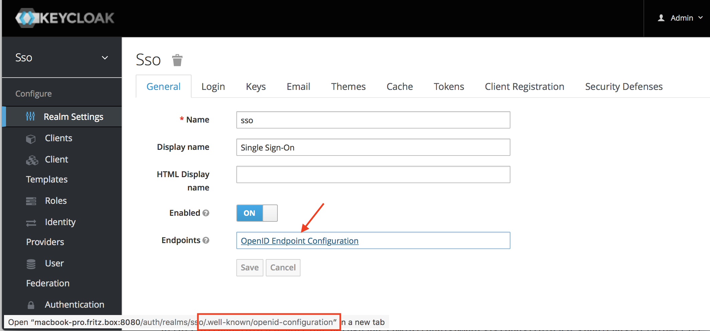
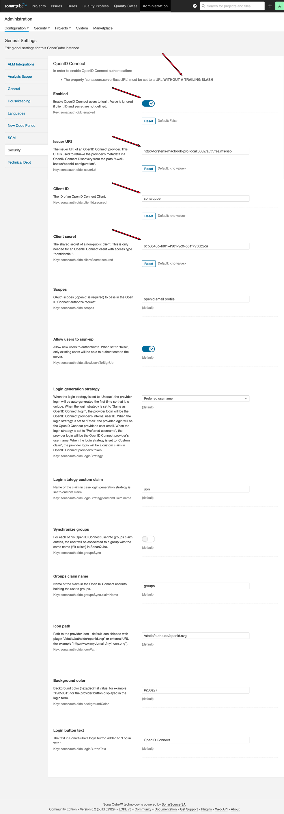

# OpenID Connect (OIDC) Plugin for SonarQube
  

## Description

This plugin enables users to automatically be sign up and authenticated on a SonarQube server via an [OpenID Connect](http://openid.net/connect/) identity provider like [Keycloak](http://www.keycloak.org). Optionally the groups a user is associated in SonarQube can be synchronized with the provider (via a custom userinfo claim retrieved from the ID token).

## Prerequisites

### Server Base URL

`Server base URL` property must be set either by setting the
URL from SonarQube administration page (General -\> Server base URL) or
through setting `sonar.core.serverBaseURL` key value in the `sonar.properties`
file.

**In this URL no trailing slash is allowed!** Otherwise the redirects from the identity provider back to the SonarQube server are not created correctly.

### Network Proxy

If a [network proxy](https://docs.oracle.com/javase/8/docs/api/java/net/doc-files/net-properties.html#Proxies) is used with SonarQube (via `http[s].proxy[Host|Port]` properties in the `sonar.properties`) and the host name of the identity provider is not resolvable by this proxy then the IdP's host name must be excluded from being resolved by the proxy. This is done by defining the property `http.nonProxyHosts` in the `sonar.properties`.

**Otherwise the plugin won't be able to send the token request to the IdP.**

## Installation

1. Install the plugin from [SonarQube marketplace](https://docs.sonarqube.org/display/SONAR/Marketplace) via "Administration > Marketplace". Or download the plugin jar from [GitHub Releases](https://github.com/vaulttec/sonar-auth-oidc/releases) and put it into the `SONARQUBE_HOME/extensions/plugins/` directory
1. Restart the SonarQube server

## Configuration

- In OpenID Connect identity provider:
  - Create a client with access type 'public' or 'confidential' (in the latter case the corresponding client secret must be set in the plugin configuration) and valid redirect URI(s) for the SonarQube server
    

  - For synchronizing SonarQube groups create a mapper which adds group names to a custom userinfo claim in the ID token (the claim's name is used in the plugin configuration later on)
    

  - Retrieve the provider's endpoint configuration as JSON text (needed for plugin configuration)
    

- In SonarQube administration (General-\> Security -\> OpenID Connect):
  - Configure the plugin for the OpenID Connect client (a client secret is only required for clients with access type 'confidential')
    

  - For synchronizing groups the name of the custom userinfo claim must be the same as defined in the identity provider's mapper

## Tested with

* SonarQube 6.7.1
* Keycloak 3.4.2.Final
* JetBrains Hub 2017.4
